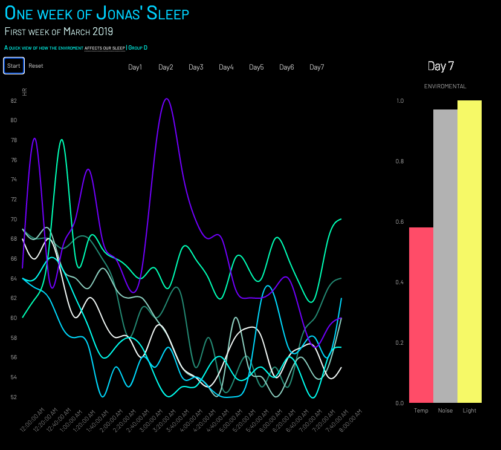

# Crimes in San Francisco (Carto)
For our "Data Visualization" class I created this Carto visualization, where I focused on where you find the most crime in San Francisco. Factors such as income, where police stations are placed in the city and population can be found while investigating the map.

/Carto/Carto.png)

### Navigating through the map (if all filters are unchecked)
As a first step, it makes the most sense to add the grid lines of the zip-code (layer 2) before adding the police stations (layer 3) to the map. From this, we can see that the police stations are placed very close to each other and keeping that in mind we can add the next layer. We start off by adding severity of crimes (layer 5) to see where the most severe crimes are located, if this view is not satisfying, we can focus on the most severe crimes (valued 5)
from the widgets. If you want to investigate certain months of the year you can use the widget “Month of Crime”, or if you want to analyze certain types of crime you can do that also. Going back to the main view we can remove the first layer and add the number of incidents (layer 4). Here we can see that most crimes are in the same areas and that every police station is either placed on or around an area of a high density of crime. We can also add the last layer (layer 1) to see that areas with little crime also has a low average income per household, and by hovering over the dollar sign we get information such as population, average income per household and rank of income compared to other zip codes in san Francisco and nationally.

To view the map on Carto please click [this link](https://jonashellevang.carto.com/builder/254d481d-e282-47d8-90cb-10e64c8e259a/embed).

# Dashboard Design (Tableau)
During the first and second assignment of the class "Business Intelligence & Datawarehousing" we created a data warehouse and data integration processes. This third assignment was done on an individual basis and focused on generating value from our data warehouse by designing a dashboard using Tableau.

The dashboard is created having the Sales Managers of the Federal Communications Commission (FCC) in mind, giving them an overview of the status of licenses specified as all, active, cancelled, expired and terminated.

/Dashboard%20Design%20(Tableau)/Dashboard.png)

### The Two Previous Assignments:
* [Data Warehouse Modelling (MySQL)](https://github.com/Jonashellevang/IE_MBD_2020/tree/master/Data%20Warehouse%20Modelling%20(MySQL))
* [Data Integration Design (Pentaho)](https://github.com/Jonashellevang/IE_MBD_2020/tree/master/Data%20Integration%20Design%20(Pentaho))

# One week of Jonas' Sleep (D3.js)
As a group assignment for our "Data Visualization" class we decided to create a visualization of my sleep where we chose a Random week of the year. I have a love of electronic devices, and have tracked movement, sleep, and other health data for years through alarm clock's, weight scales, Apple Watch and my iPhone. It was fun to see how it was possible to visualize some of this data.

The code can be viewed [here](http://bl.ocks.org/Jonashellevang/03ec4d5e4593a451445e8726076dbe61), and the visualization is best viewed by [clicking this link](http://bl.ocks.org/Jonashellevang/raw/03ec4d5e4593a451445e8726076dbe61/).

### How to start the visualization
To get the visualization going, you click on the day you want to look at where "Day1" is Monday and so on, and click start. By doing so you can see that the bar line is moving through the hours of the night. You can also reset the chart, or simply press a new day and look at the new visualization, comparing the days with each other.

#
